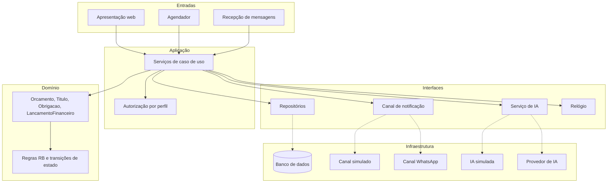

# Arquitetura — RemindMe

A arquitetura responde ao que já está descrito em [requisitos](requisitos.md), [modelo de domínio](modelo-dominio.md) e [casos de uso](casos-de-uso/README.md). Este documento seleciona o que mais pesa (drivers), registra as decisões técnicas e descreve a estrutura resultante.

> **Situação.** As decisões abaixo estão propostas e aguardam aprovação da equipe. As escolhas de tecnologia ainda não foram feitas e estão em [`.specify/open.md`](../.specify/open.md).

## 1. Visão arquitetural

O RemindMe é uma aplicação web única (monólito), organizada em camadas, com o domínio isolado de framework, banco de dados e serviços externos. O canal de notificação e o serviço de IA são acessados por interfaces substituíveis, com implementações simuladas como padrão.

A razão está no próprio problema: o valor do sistema são as regras de estado e de alçada. Elas precisam valer para qualquer entrada (tela, agendador, importação CSV, mensagem de cliente) e precisam ser testáveis sem banco e sem interface.

## 2. Drivers arquiteturais

Nem todo requisito é driver. Os itens abaixo são os que mudam a estrutura do sistema.

| ID | Driver | Origem |
|---|---|---|
| DA-01 | As transições de estado de título, orçamento e obrigação são invariantes de domínio, válidas para qualquer chamador. | RB-21, RB-05, RB-22, RF-12, RF-24 |
| DA-02 | Toda mudança de estado é auditada, e a auditoria é imutável. | RB-01, RB-30, RNF-06 |
| DA-03 | Operações financeiras são atômicas. | RNF-09, RB-19 |
| DA-04 | O acesso é negado por padrão, por perfil, e o Cliente só alcança os próprios dados. | RNF-02, RNF-03, RNF-25, RB-03, RB-26 |
| DA-05 | Há processamento disparado por tempo, que não pode degradar o uso interativo. | RF-24, RF-33, RF-34, RF-44, RF-48, RNF-12, RNF-13 |
| DA-06 | A IA é falível e nunca decide. | RB-08, RB-14, RB-17, RB-27, RNF-24 |
| DA-07 | A suíte de testes roda sem credencial externa. | RNF-23, RB-18 |
| DA-08 | A régua não repete uma etapa para o mesmo título. | UC-08, RF-35 |
| DA-09 | Cada regra de negócio tem um único ponto de implementação e um teste com seu identificador. | RNF-19 |
| DA-10 | Configuração alterada não reescreve o passado. | RNF-18, RF-36 |

## 3. Decisões técnicas

| ID | Driver | Decisão técnica | ADR |
|---|---|---|---|
| DT-01 | DA-01, DA-09 | Monólito em camadas. O domínio não depende de framework, banco ou serviço externo. Regra de negócio não fica em controlador nem em gatilho de banco. | [ADR-001](adr/ADR-001-monolito-em-camadas-com-dominio-isolado.md) |
| DT-02 | DA-07 | Canal de notificação atrás de uma interface, com implementação simulada como padrão. | [ADR-002](adr/ADR-002-canal-de-notificacao-substituivel.md) |
| DT-03 | DA-06, DA-07 | Serviço de IA atrás de uma interface. A saída é validada por regra determinística antes de qualquer efeito. Falha ou tempo excedido equivale a "sem sugestão". | [ADR-003](adr/ADR-003-ia-extrai-e-classifica-o-sistema-decide.md) |
| DT-04 | DA-02 | Auditoria somente de inclusão, gravada na mesma transação da operação auditada. | [ADR-004](adr/ADR-004-auditoria-somente-inclusao.md) |
| DT-05 | DA-03 | Cada caso de uso que altera dados executa em uma única transação. | Não pede ADR |
| DT-06 | DA-04 | Autorização verificada na camada de aplicação, antes do domínio. O filtro por cliente fica dentro da própria consulta. | Não pede ADR |
| DT-07 | DA-05 | Agendador como entrada separada da interface web, chamando os mesmos casos de uso. | Não pede ADR por ora; mecanismo em aberto (OPEN-13) |
| DT-08 | DA-08 | Unicidade de tentativa por título e etapa. Execução repetida do agendador não gera novo envio. | Não pede ADR |
| DT-09 | DA-10 | Parâmetros de régua, alçada e limites são lidos no momento do processamento e não copiados para registros antigos. | Não pede ADR |

O critério para escrever ADR é a reversibilidade. DT-01 a DT-04 amarram o projeto: mudar qualquer uma depois obriga reescrita de camada ou migração de dados. As demais são baratas de desfazer.

## 4. Descrição da arquitetura

### Camadas

| Camada | Responsabilidade | Conhece |
|---|---|---|
| Apresentação | Telas e API. Recebe a requisição, autentica e devolve a resposta. | Aplicação |
| Entradas automáticas | Agendador e recepção de mensagens de clientes. | Aplicação |
| Aplicação | Um serviço por caso de uso. Verifica permissão, abre a transação, chama o domínio, grava a auditoria. | Domínio e interfaces |
| Domínio | Classes do modelo, estados, transições e regras de negócio. | Nada externo |
| Infraestrutura | Persistência, canal de notificação, serviço de IA, relógio. Implementa as interfaces. | Domínio |

Regra de dependência: as setas apontam para o domínio. O domínio não importa nada das outras camadas.

### Módulos

Os agrupamentos naturais do modelo de domínio viram módulos do sistema.

| Módulo | Classes | Casos de uso |
|---|---|---|
| Acesso | `Usuario`, `Perfil`, `AlcadaDesconto` | UC-01, UC-02 |
| Comercial | `Cliente`, `Orcamento`, `ItemOrcamento`, `AprovacaoDesconto` | UC-03, UC-04, UC-05 |
| Recebíveis | `Titulo`, `Pagamento`, `Renegociacao` | UC-06, UC-07 |
| Cobrança | `ReguaCobranca`, `EtapaCobranca`, `TentativaCobranca` | UC-08 |
| Obrigações | `Obrigacao`, `Evidencia` | UC-09 |
| Resultado | `LancamentoFinanceiro`, `CategoriaFinanceira`, `SugestaoClassificacao` | UC-10, UC-11 |
| Auditoria | `RegistroAuditoria` | UC-12 |
| Configuração e intercâmbio | — | UC-13, UC-14 |

### Onde mora cada atributo de qualidade

| Pergunta | Resposta |
|---|---|
| Onde fica a regra de autorização? | Na camada de aplicação, antes de chamar o domínio. Negar é o padrão. |
| Onde ficam as regras de negócio? | No domínio. Nunca em controlador, tela ou banco. |
| Como testar uma regra? | Teste de unidade do domínio, sem banco e sem interface, nomeado pelo identificador da regra. |
| O que domina o custo do fluxo central? | A varredura periódica de títulos pela régua. Ela roda fora do caminho interativo. |
| O que acontece se a IA falhar? | O lançamento ou a mensagem segue para tratamento humano. Nenhuma operação depende da IA para terminar. |

## 5. Escolhas tecnológicas

Ainda não decididas. Cada item tem uma questão em aberto, com as restrições que os drivers impõem.

| Escolha | Restrição vinda dos drivers | Questão |
|---|---|---|
| Linguagem e framework web | Deve permitir domínio sem dependência do framework (DA-01) | OPEN-01 |
| Banco de dados | Deve oferecer transações (DA-03) e restrição de unicidade (DA-08) | OPEN-02 |
| Mecanismo de sessão | Deve permitir negar por padrão em toda rota (DA-04) | OPEN-03 |
| Provedor de IA | Deve ser trocável sem alterar o domínio (DA-06, DA-07) | OPEN-04 |
| Hospedagem | — | OPEN-12 |
| Mecanismo do agendador | Não pode degradar o uso interativo (DA-05) | OPEN-13 |

## 6. Rastreabilidade

| Artefato anterior | Onde aparece na arquitetura |
|---|---|
| RB de estado (RB-05, RB-21, RB-22) | Domínio; DA-01; ADR-001 |
| RNF de segurança (RNF-01 a RNF-06, RNF-25) | Camada de aplicação; DA-02, DA-04; ADR-004 |
| RNF de desempenho (RNF-11 a RNF-13) | Entradas automáticas separadas; DA-05 |
| RB da IA (RB-08, RB-14, RB-17, RB-27) | Interface do serviço de IA; DA-06; ADR-003 |
| RNF-23 e RB-18 | Implementações simuladas; DA-07; ADR-002 |
| Modelo de domínio | Módulos |
| Casos de uso | Serviços da camada de aplicação |
