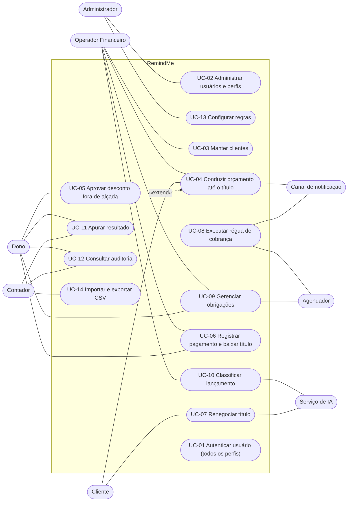

# Casos de Uso — RemindMe

Cada caso de uso descreve uma interação que entrega valor a um ator. Cada um tem ator, gatilho, pré-condições, fluxo principal, fluxos alternativos, exceções e pós-condições, e cita as regras de negócio pelo identificador.

## Atores

| Ator | Tipo | Papel |
|---|---|---|
| Dono | Pessoa | Decide exceções: desconto fora de alçada, estorno, obrigação atrasada. Consulta resultado e auditoria. |
| Operador Financeiro | Pessoa | Executa a rotina de orçamentos, títulos, pagamentos, classificação e obrigações, dentro da sua alçada. |
| Cliente | Pessoa | Decide orçamentos, consulta seus títulos e propõe renegociação. |
| Contador | Pessoa | Consulta e exporta dados consolidados. Somente leitura. |
| Administrador | Pessoa | Mantém usuários, perfis e configurações. Pode ser acumulado pelo Dono (OPEN-10). |
| Agendador | Sistema | Dispara verificações periódicas de vencimentos, régua e prazos de obrigações. |
| Canal de notificação | Sistema externo | Entrega orçamentos, cobranças e alertas. O padrão é o canal simulado. |
| Serviço de IA | Sistema externo | Sugere categorias e extrai intenção de mensagens. Não decide. |

## Diagrama de casos de uso

Fonte: [`../uml/casos-de-uso.mmd`](../uml/casos-de-uso.mmd). Imagem: [`../uml/casos-de-uso.png`](../uml/casos-de-uso.png).

O UC-05 estende o UC-04: só ocorre quando o desconto ultrapassa a alçada. O UC-01 é pré-condição de todos os casos de uso iniciados por pessoas e por isso não tem linhas no diagrama.

## Lista

| ID | Caso de uso | Ator principal | Atores de apoio |
|---|---|---|---|
| [UC-01](UC-01-autenticar-usuario.md) | Autenticar usuário | Usuário de qualquer perfil | — |
| [UC-02](UC-02-administrar-usuarios-e-perfis.md) | Administrar usuários e perfis | Administrador | — |
| [UC-03](UC-03-manter-clientes.md) | Manter clientes | Operador Financeiro | Dono |
| [UC-04](UC-04-conduzir-orcamento-ate-o-titulo.md) | Conduzir orçamento até o título | Operador Financeiro | Cliente, Dono, Canal de notificação |
| [UC-05](UC-05-aprovar-desconto-fora-de-alcada.md) | Aprovar desconto fora de alçada | Dono | Operador Financeiro |
| [UC-06](UC-06-registrar-pagamento-e-baixar-titulo.md) | Registrar pagamento e baixar título | Operador Financeiro | Dono |
| [UC-07](UC-07-renegociar-titulo.md) | Renegociar título | Cliente | Serviço de IA, Operador Financeiro, Dono |
| [UC-08](UC-08-executar-regua-de-cobranca.md) | Executar régua de cobrança | Agendador | Canal de notificação, Operador Financeiro, Cliente |
| [UC-09](UC-09-gerenciar-obrigacoes.md) | Gerenciar obrigações | Operador Financeiro | Dono, Agendador |
| [UC-10](UC-10-classificar-lancamento.md) | Classificar lançamento | Operador Financeiro | Serviço de IA, Dono |
| [UC-11](UC-11-apurar-resultado.md) | Apurar resultado | Dono | Contador, Operador Financeiro |
| [UC-12](UC-12-consultar-auditoria.md) | Consultar auditoria | Dono | Contador, Administrador |
| [UC-13](UC-13-configurar-regras.md) | Configurar regras | Administrador | Dono |
| [UC-14](UC-14-importar-e-exportar-csv.md) | Importar e exportar CSV | Operador Financeiro | Contador, Administrador |

O **fluxo principal do sistema** é a sequência UC-04 → UC-08 → UC-06: o orçamento vira título, o título é cobrado e o pagamento o baixa. Os diagramas de sequência cobrem o UC-04 e o UC-06.

## Regras que valem para todos os casos de uso

1. Todo caso de uso iniciado por pessoa exige sessão ativa (RNF-01) e permissão do perfil (RNF-02).
2. Toda mudança de estado é auditada (RB-01).
3. A IA extrai e classifica; o sistema decide (RB-27).
4. Falha em operação financeira não deixa dado parcialmente gravado (RNF-09).

## Cobertura dos requisitos funcionais

| Requisitos | Casos de uso |
|---|---|
| RF-01 | UC-03 |
| RF-02, RF-03 | UC-02, UC-13 |
| RF-04, RF-05, RF-61, RF-62, RF-64 | UC-12 e, como regra geral, todos |
| RF-06 a RF-13, RF-19 | UC-04 |
| RF-14 a RF-18 | UC-05, UC-13 |
| RF-20 a RF-27, RF-30, RF-31, RF-68 | UC-06 |
| RF-28, RF-29, RF-69, RF-72 a RF-76 | UC-07 |
| RF-32 a RF-39, RF-70, RF-71 | UC-08, UC-13 |
| RF-40 a RF-50, RF-77 | UC-09 |
| RF-51, RF-52, RF-58, RF-59, RF-78 a RF-81 | UC-10 |
| RF-53 a RF-57, RF-82 | UC-11 |
| RF-65 a RF-67 | UC-01 |
| RF-83 a RF-85 | UC-14 |

RF-60 e RF-63 foram retirados; ver [requisitos](../requisitos.md).

## Fora do escopo

Emissão de nota fiscal, integração com a SEFAZ, folha de pagamento, RH e aconselhamento financeiro. Ver [visão](../visao.md#6-escopo).
