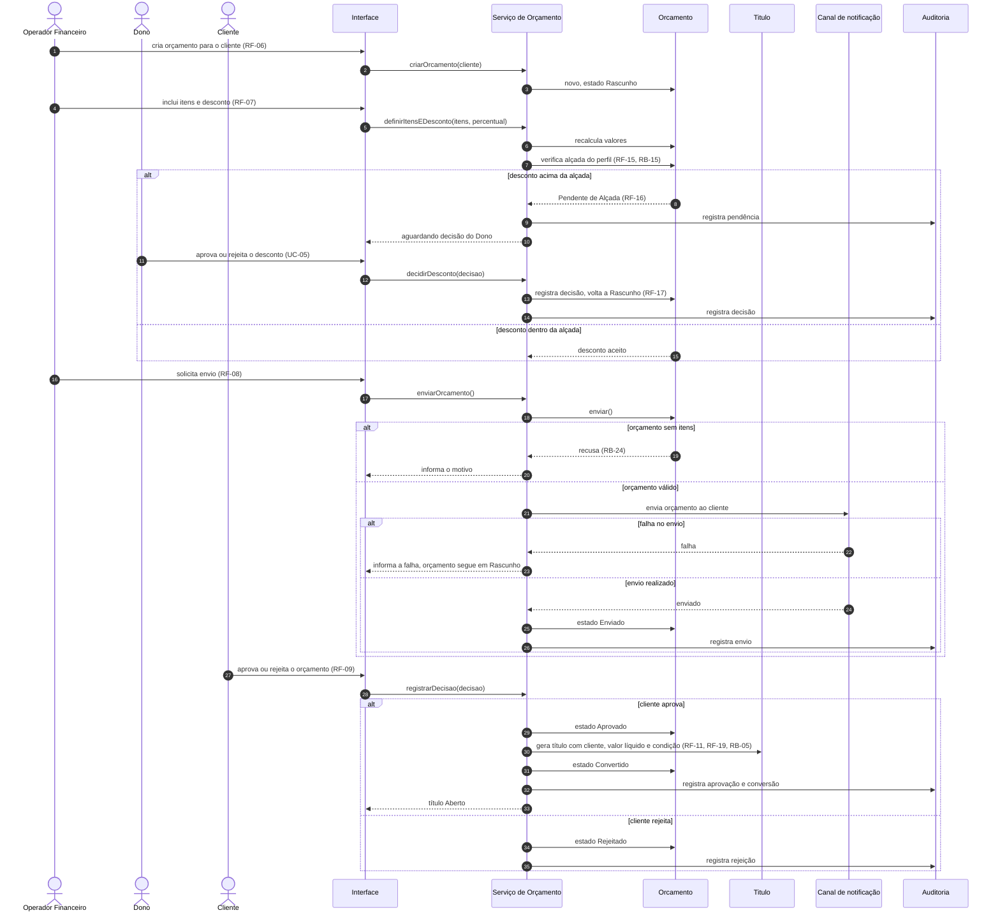

# UC-04 — Conduzir orçamento até o título

| | |
|---|---|
| **Ator principal** | Operador Financeiro |
| **Atores de apoio** | Cliente, Dono, Canal de notificação |
| **Objetivo** | Levar um orçamento da criação até a decisão do cliente e, se aprovado, ao título a receber. |
| **Gatilho** | O Operador Financeiro solicita um novo orçamento para um cliente. |
| **Regras de negócio** | RB-01, RB-05, RB-15, RB-24 |
| **Requisitos** | RF-06 a RF-13, RF-15, RF-18, RF-19, RNF-09 |

## Pré-condições

- O Operador Financeiro está autenticado.
- O cliente está cadastrado (UC-03).

## Fluxo principal

1. O Operador Financeiro cria o orçamento para o cliente. O sistema o coloca em Rascunho.
2. O Operador Financeiro inclui os itens, com quantidade e valor unitário, a condição de pagamento e o desconto.
3. O sistema calcula o valor bruto, o desconto e o valor líquido.
4. O sistema compara o desconto com a alçada do perfil do Operador Financeiro (RB-15).
5. O Operador Financeiro solicita o envio.
6. O sistema envia o orçamento ao cliente pelo canal de notificação e muda o estado para Enviado.
7. O Cliente aprova o orçamento.
8. O sistema muda o estado para Aprovado, gera o título a receber com o cliente, o valor líquido e a condição de pagamento, e muda o estado do orçamento para Convertido (RB-05).
9. O sistema registra cada mudança de estado na auditoria.

## Fluxos alternativos

- **A1 — Desconto acima da alçada.** No passo 4, o sistema muda o orçamento para Pendente de Alçada e segue para o UC-05. Com a decisão do Dono, o orçamento volta a Rascunho e o fluxo retoma no passo 5.
- **A2 — Cliente rejeita.** No passo 7, o Cliente rejeita. O sistema muda o estado para Rejeitado e nenhum título é gerado.
- **A3 — Cancelamento.** Antes do passo 8, um usuário autorizado cancela o orçamento informando o motivo. O sistema muda o estado para Cancelado (RF-13).

## Exceções

- **E1 — Orçamento sem itens.** No passo 5, o sistema recusa o envio e informa o motivo (RB-24).
- **E2 — Falha no canal de notificação.** No passo 6, o sistema informa a falha e mantém o orçamento em Rascunho, sem registrar envio.
- **E3 — Conversão de orçamento não aprovado.** Se for solicitada a conversão de um orçamento que não está Aprovado, o sistema impede e informa o estado atual (RF-12).
- **E4 — Falha ao gerar o título.** No passo 8, se a geração do título falhar, o sistema desfaz a aprovação. O orçamento permanece Enviado (RNF-09).

## Pós-condições

- Sucesso: orçamento Convertido e título Aberto vinculado a ele.
- Alternativo: orçamento Rejeitado ou Cancelado, sem título.
- Em todos os casos: mudanças de estado auditadas.

## Diagramas

- Sequência do fluxo principal: [`seq-UC-04.png`](../uml/seq-UC-04.png), fonte em [`seq-UC-04.mmd`](../uml/seq-UC-04.mmd).
- Estados do orçamento: [estados](../uml/estados.md#orçamento).

