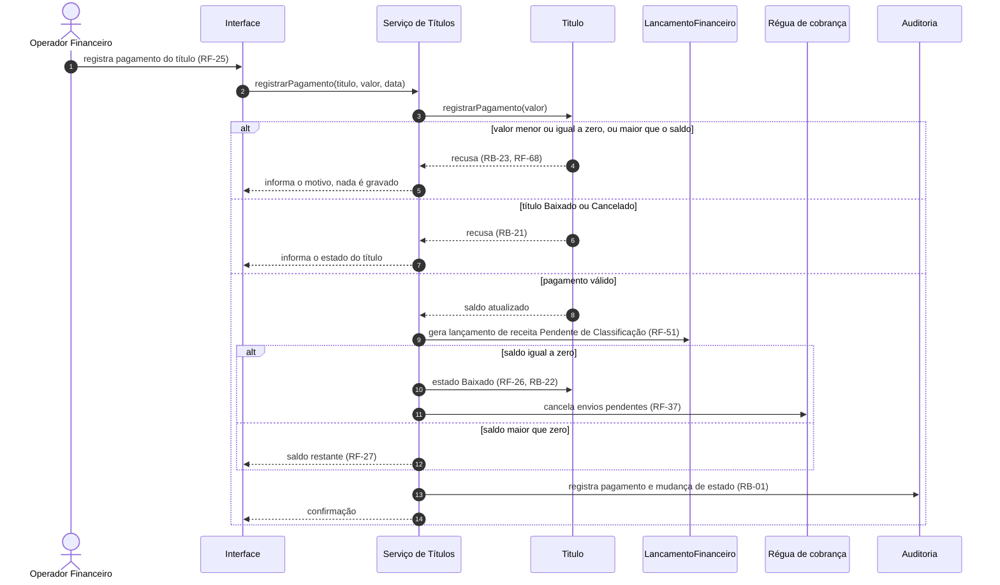

# UC-06 — Registrar pagamento e baixar título

| | |
|---|---|
| **Ator principal** | Operador Financeiro |
| **Atores de apoio** | Dono |
| **Objetivo** | Registrar o que o cliente pagou e manter saldo e estado do título corretos. |
| **Gatilho** | O Operador Financeiro recebe a confirmação de um pagamento. |
| **Regras de negócio** | RB-01, RB-02, RB-06, RB-21, RB-22, RB-23 |
| **Requisitos** | RF-20 a RF-27, RF-30, RF-31, RF-37, RF-51, RF-68, RNF-09 |

## Pré-condições

- O Operador Financeiro está autenticado.
- O título está Aberto, Vencido ou Em Renegociação.

## Fluxo principal

1. O Operador Financeiro localiza o título por cliente, vencimento ou estado.
2. O Operador Financeiro informa o valor e a data do pagamento.
3. O sistema valida o valor contra o saldo do título (RB-23).
4. O sistema registra o pagamento e reduz o saldo.
5. O saldo chega a zero. O sistema muda o estado do título para Baixado (RB-22).
6. O sistema cancela os envios pendentes da régua de cobrança para o título.
7. O sistema gera o lançamento de receita, que segue para classificação (UC-10).
8. O sistema registra a operação na auditoria.

## Fluxos alternativos

- **A1 — Pagamento parcial.** No passo 5, o saldo continua maior que zero. O sistema mantém o estado do título e apresenta o saldo restante. Os passos 7 e 8 ocorrem; o passo 6, não.
- **A2 — Cadastro manual de título.** Antes do passo 1, o usuário cadastra um título sem orçamento, com cliente, valor e vencimento. O sistema o cria em Aberto (RF-20).
- **A3 — Estorno.** O Dono seleciona um pagamento e solicita o estorno, informando o motivo. O sistema anula o pagamento, restaura o saldo, gera o lançamento de sinal contrário e devolve o título a Aberto ou Vencido, conforme o vencimento (RB-02).
- **A4 — Cancelamento de título.** Um usuário autorizado cancela um título Aberto ou Vencido informando o motivo. O sistema muda o estado para Cancelado e cancela os envios pendentes da régua.

## Exceções

- **E1 — Valor inválido.** No passo 3, o valor é menor ou igual a zero ou maior que o saldo. O sistema recusa o pagamento e nada é gravado (RF-68).
- **E2 — Título Baixado ou Cancelado.** No passo 2, o sistema recusa o pagamento e informa o estado do título (RB-21).
- **E3 — Estorno por perfil não autorizado.** Em A3, se o usuário não for o Dono, o sistema nega a operação (RB-02).
- **E4 — Motivo ausente.** Em A3 ou A4, sem motivo informado, o sistema recusa a operação (RF-31).
- **E5 — Falha durante a operação.** O sistema desfaz todas as alterações: pagamento, saldo, estado e lançamento (RNF-09).

## Pós-condições

- Sucesso: pagamento registrado; saldo atualizado; título Baixado quando o saldo é zero; lançamento gerado; operação auditada.
- Falha: título, saldo e lançamentos inalterados.

## Diagramas

- Sequência do fluxo principal: [`seq-UC-06.png`](../uml/seq-UC-06.png), fonte em [`seq-UC-06.mmd`](../uml/seq-UC-06.mmd).
- Estados do título: [estados](../uml/estados.md#título).

