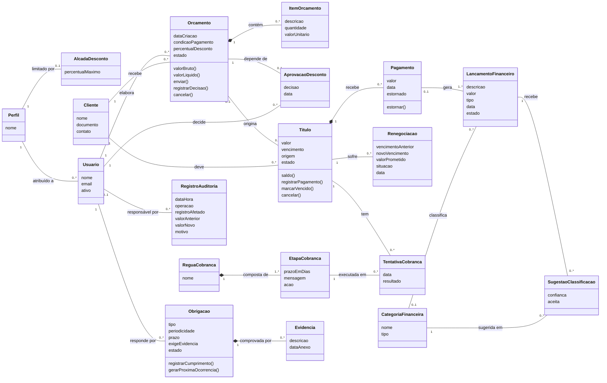

# Modelo de Domínio — RemindMe

Conceitos do negócio, suas responsabilidades, relações e regras. O modelo descreve o domínio: não descreve banco de dados, telas nem arquitetura.

Este texto é a fonte. O diagrama é uma vista dele e deve ser regerado quando o texto mudar. O vocabulário está no [glossário](glossario.md).

## 1. Classes e responsabilidades

| Classe | Responsabilidade | Regras que guarda |
|---|---|---|
| `Perfil` | Define o papel de acesso de um usuário. | RB-03 |
| `AlcadaDesconto` | Limita o desconto que um perfil concede sem aprovação. | RB-15 |
| `Usuario` | Identifica quem opera o sistema e responde por cada operação. | RB-01 |
| `Cliente` | Identifica quem recebe orçamentos e deve títulos. | RB-26 |
| `Orcamento` | Conduz a proposta comercial do rascunho à conversão em título. Calcula seus valores e controla seu estado. | RB-05, RB-15, RB-24 |
| `ItemOrcamento` | Descreve um produto ou serviço orçado, com quantidade e valor. | RB-24 |
| `AprovacaoDesconto` | Registra a decisão do Dono sobre um desconto acima da alçada. | RB-15 |
| `Titulo` | Representa um valor a receber. Controla saldo, vencimento e estado. É a classe central do modelo. | RB-10, RB-11, RB-21, RB-22, RB-23 |
| `Pagamento` | Registra um valor recebido para um título. Pode ser estornado. | RB-02, RB-23 |
| `Renegociacao` | Registra a mudança de condições de um título, preservando as condições originais. | RB-20, RB-28 |
| `ReguaCobranca` | Agrupa as etapas de cobrança aplicadas aos títulos. | RB-10 |
| `EtapaCobranca` | Define quando e como cobrar: prazo em dias em relação ao vencimento, mensagem e ação. | — |
| `TentativaCobranca` | Registra a execução de uma etapa para um título, com data e resultado. | RB-01 |
| `Obrigacao` | Representa um compromisso fiscal ou contratual com prazo e responsável. Controla seu estado e gera a próxima ocorrência. | RB-07, RB-13, RB-16, RB-29 |
| `Evidencia` | Comprova o cumprimento de uma obrigação. | RB-29 |
| `LancamentoFinanceiro` | Registra uma receita ou despesa para a apuração do resultado. | RB-06, RB-12 |
| `CategoriaFinanceira` | Representa uma conta do plano de contas, de receita ou de despesa. | RB-08 |
| `SugestaoClassificacao` | Guarda a categoria sugerida pela IA, a confiança e se foi aceita. | RB-08, RB-09, RB-14 |
| `RegistroAuditoria` | Registra uma operação de forma imutável. | RB-01, RB-30 |

### O que ficou fora do modelo

- **Canal de notificação, serviço de IA e agendador** são atores e mecanismos, e não conceitos do negócio. Aparecem nos casos de uso e na arquitetura.
- **Fila de revisão** não é classe. É o conjunto dos lançamentos no estado Pendente de Classificação.
- **Painel, tela, relatório e arquivo CSV** são termos técnicos ou de interface.

## 2. Relações e multiplicidades

1. Um `Perfil` é atribuído a zero ou mais `Usuario`. Cada `Usuario` tem exatamente um `Perfil`.
2. Um `Perfil` tem zero ou uma `AlcadaDesconto`. Perfil sem alçada não concede desconto; o perfil Dono não tem limite (RB-15).
3. Um `Usuario` elabora zero ou mais `Orcamento`. Cada `Orcamento` é elaborado por exatamente um `Usuario`.
4. Um `Cliente` recebe zero ou mais `Orcamento`. Cada `Orcamento` é de exatamente um `Cliente`.
5. Um `Orcamento` contém zero ou mais `ItemOrcamento`, por composição: o item não existe fora do orçamento. Um orçamento em Rascunho pode estar sem itens, mas só é enviado com ao menos um (RB-24).
6. Um `Orcamento` depende de zero ou uma `AprovacaoDesconto`. Cada `AprovacaoDesconto` é decidida por exatamente um `Usuario`, de perfil Dono.
7. Um `Orcamento` origina zero ou um `Titulo`. Um `Titulo` vem de zero ou um `Orcamento`: título cadastrado manualmente não tem orçamento (RF-20).
8. Um `Cliente` deve zero ou mais `Titulo`. Cada `Titulo` é devido por exatamente um `Cliente`.
9. Um `Titulo` recebe zero ou mais `Pagamento`, por composição.
10. Um `Titulo` sofre zero ou mais `Renegociacao`. Cada `Renegociacao` é de exatamente um `Titulo`.
11. Uma `ReguaCobranca` é composta de uma ou mais `EtapaCobranca`. Régua sem etapa é inválida.
12. Um `Titulo` tem zero ou mais `TentativaCobranca`. Cada `TentativaCobranca` é de exatamente um `Titulo` e executa exatamente uma `EtapaCobranca`.
13. Um `Usuario` responde por zero ou mais `Obrigacao`. Cada `Obrigacao` tem exatamente um responsável.
14. Uma `Obrigacao` é comprovada por zero ou mais `Evidencia`, por composição.
15. Um `Pagamento` gera um ou mais `LancamentoFinanceiro`: um no registro e outro, de sinal contrário, se for estornado. Um `LancamentoFinanceiro` vem de zero ou um `Pagamento`.
16. Uma `CategoriaFinanceira` classifica zero ou mais `LancamentoFinanceiro`. Um `LancamentoFinanceiro` tem zero ou uma `CategoriaFinanceira`; sem categoria, está Pendente de Classificação (RB-12).
17. Um `LancamentoFinanceiro` recebe zero ou mais `SugestaoClassificacao`. Cada `SugestaoClassificacao` aponta exatamente uma `CategoriaFinanceira`.
18. Um `Usuario` é responsável por zero ou mais `RegistroAuditoria`. Um `RegistroAuditoria` tem zero ou um `Usuario`: operações automáticas do sistema não têm usuário.

## 3. Atributos derivados e operações que representam regra

| Classe | Operação | Regra |
|---|---|---|
| `Orcamento` | `valorBruto()` | Soma de quantidade × valor unitário dos itens. |
| `Orcamento` | `valorLiquido()` | Valor bruto menos o desconto percentual. |
| `Orcamento` | `enviar()` | Exige ao menos um item (RB-24) e desconto dentro da alçada ou aprovado (RB-15). |
| `Orcamento` | `registrarDecisao()` | Só aceita decisão em orçamento Enviado. Aprovação gera o título (RB-05). |
| `Titulo` | `saldo()` | Valor menos a soma dos pagamentos não estornados. |
| `Titulo` | `registrarPagamento()` | Recusa valor menor ou igual a zero ou maior que o saldo (RB-23). Saldo zero baixa o título (RB-22). |
| `Titulo` | `marcarVencido()` | Só se aplica a título Aberto com saldo maior que zero e vencimento passado (RB-21). |
| `Pagamento` | `estornar()` | Só o Dono executa (RB-02). Restaura o saldo do título. |
| `Obrigacao` | `registrarCumprimento()` | Exige evidência quando a obrigação a exige (RB-29). |
| `Obrigacao` | `gerarProximaOcorrencia()` | Calcula o novo prazo pela periodicidade. |

## 4. Ciclos de vida

Orçamento, título e obrigação têm estados explícitos. Os diagramas e as tabelas de transição estão em [estados](uml/estados.md).

## 5. Diagrama de classes conceitual

Fonte: [`uml/dominio-v2.mmd`](uml/dominio-v2.mmd). Imagem exportada: [`uml/dominio-v2.png`](uml/dominio-v2.png).

## 6. Rastreabilidade requisito → classe

| Requisitos | Classes |
|---|---|
| RF-01 | `Cliente` |
| RF-02, RF-03, RF-65 a RF-67 | `Usuario`, `Perfil` |
| RF-06 a RF-13 | `Orcamento`, `ItemOrcamento` |
| RF-14 a RF-18 | `AlcadaDesconto`, `AprovacaoDesconto`, `Orcamento` |
| RF-19 a RF-27, RF-30, RF-31, RF-68, RF-69 | `Titulo`, `Pagamento` |
| RF-28, RF-29, RF-72 a RF-76 | `Renegociacao`, `Titulo` |
| RF-32 a RF-39, RF-70, RF-71 | `ReguaCobranca`, `EtapaCobranca`, `TentativaCobranca` |
| RF-40 a RF-50, RF-77 | `Obrigacao`, `Evidencia` |
| RF-51, RF-52, RF-58, RF-59, RF-78 a RF-81 | `LancamentoFinanceiro`, `CategoriaFinanceira`, `SugestaoClassificacao` |
| RF-53 a RF-57, RF-82 | `LancamentoFinanceiro`, `CategoriaFinanceira` |
| RF-04, RF-05, RF-61, RF-62, RF-64 | `RegistroAuditoria` |

## 7. Histórico

| Versão | Mudança |
|---|---|
| v1 | Primeira versão do diagrama. |
| v2 | Corrigida a multiplicidade entre `Usuario` e `Perfil`. Incluídos `Renegociacao`, `Evidencia`, `AprovacaoDesconto`, `SugestaoClassificacao` e `RegistroAuditoria`. `Titulo` passou a se ligar diretamente a `Cliente`. `HistoricoCobranca` virou `TentativaCobranca` e `SequenciaCobranca` virou `ReguaCobranca`. Removidos identificadores técnicos dos atributos. |
