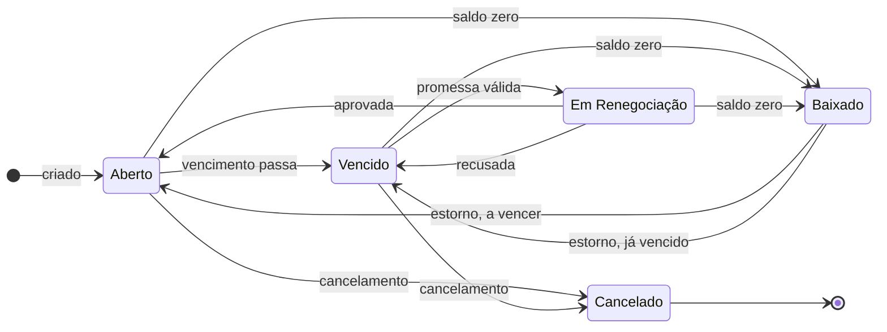
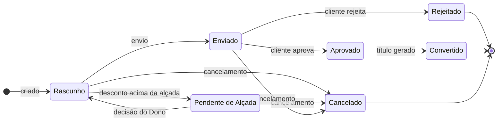
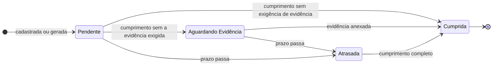

# Estados — RemindMe

Ciclos de vida das três entidades com estado explícito. Uma transição que não está na tabela é inválida e deve ser recusada.

## Título

Regra: RB-21. Imagem: [`estados-titulo.png`](estados-titulo.png).

| De | Para | Gatilho | Requisito |
|---|---|---|---|
| — | Aberto | Título gerado de orçamento ou cadastrado manualmente | RF-11, RF-20 |
| Aberto | Vencido | Vencimento passa com saldo maior que zero | RF-24 |
| Aberto, Vencido, Em Renegociação | Baixado | Saldo chega a zero | RF-26 |
| Vencido | Em Renegociação | Promessa de pagamento válida do cliente | RF-73 |
| Em Renegociação | Aberto | Renegociação aprovada, com novo vencimento | RF-28 |
| Em Renegociação | Vencido | Proposta recusada | RF-76 |
| Baixado | Aberto | Estorno pelo Dono, com vencimento futuro | RF-30 |
| Baixado | Vencido | Estorno pelo Dono, com vencimento passado | RF-30 |
| Aberto, Vencido | Cancelado | Cancelamento com motivo | RF-31 |

Cláusulas de estado derivadas:

- WHILE o título estiver Vencido, o sistema cobra pela régua (RF-34).
- WHILE o título estiver Em Renegociação, o sistema suspende a régua (RF-70).
- IF for solicitado pagamento em título Baixado ou Cancelado, THEN o sistema recusa (RB-21).

## Orçamento

Imagem: [`estados-orcamento.png`](estados-orcamento.png).

| De | Para | Gatilho | Requisito |
|---|---|---|---|
| — | Rascunho | Orçamento criado | RF-06 |
| Rascunho | Pendente de Alçada | Desconto acima da alçada de quem elaborou | RF-16 |
| Pendente de Alçada | Rascunho | Dono aprova ou rejeita o desconto | RF-17 |
| Rascunho | Enviado | Envio com ao menos um item e desconto permitido | RF-08 |
| Enviado | Aprovado | Cliente aprova | RF-09 |
| Enviado | Rejeitado | Cliente rejeita | RF-09 |
| Aprovado | Convertido | Título gerado | RF-11 |
| Rascunho, Pendente de Alçada, Enviado | Cancelado | Cancelamento com motivo | RF-13 |

Aprovado é um estado de passagem: a conversão ocorre na mesma operação da aprovação (RB-05). Se o desconto for rejeitado pelo Dono, o orçamento volta a Rascunho com o desconto anterior.

## Obrigação

Imagem: [`estados-obrigacao.png`](estados-obrigacao.png).

| De | Para | Gatilho | Requisito |
|---|---|---|---|
| — | Pendente | Obrigação cadastrada ou ocorrência gerada | RF-40, RF-42 |
| Pendente | Cumprida | Cumprimento registrado; evidência não exigida ou já anexada | RF-45, RF-46 |
| Pendente | Aguardando Evidência | Cumprimento registrado sem a evidência exigida | RF-46 |
| Aguardando Evidência | Cumprida | Evidência anexada | RF-46 |
| Pendente, Aguardando Evidência | Atrasada | Prazo passa | RF-48 |
| Atrasada | Cumprida | Cumprimento registrado, com evidência quando exigida | RF-45, RF-46 |

Cláusulas de estado derivadas:

- WHILE a obrigação estiver Aguardando Evidência, o alerta permanece no painel do Operador Financeiro (RF-77).
- IF a obrigação permanecer Atrasada pela tolerância configurada, THEN o sistema escala ao Dono (RF-49).
